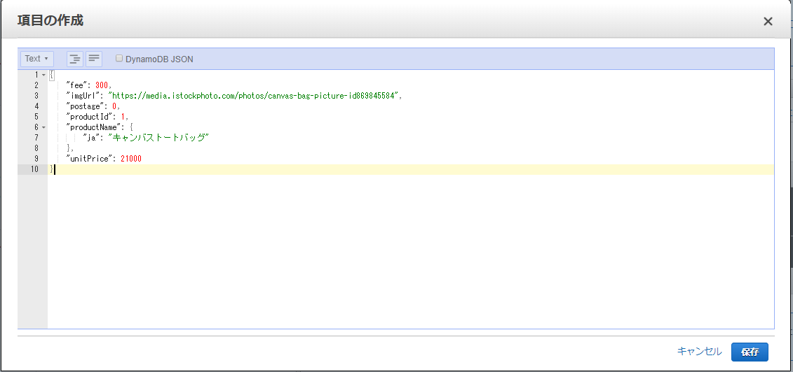

# テストデータの投入
## DynamoDB へテストデータの投入  
  本アプリの動作には作成したDynamoDBテーブルにデータを投入する必要があります。
  会員証アプリデプロイ時に template.yamlのProductInfoDBName に設定したテーブル名のテーブルに、サンプルデータを投入してください。
  テストデータはbackend -> APPフォルダ内、dynamodb_data/product_master_id_1.json ~ product_master_id_2.json の json 形式文字列です。
  AWSマネジメントコンソールの DynamoDB コンソールにて、ペーストして投入します。(※以下画像参照)
  
  【テストデータの投入】  
  

[次の頁へ](validation.md)

[目次へ戻る](../README.md)